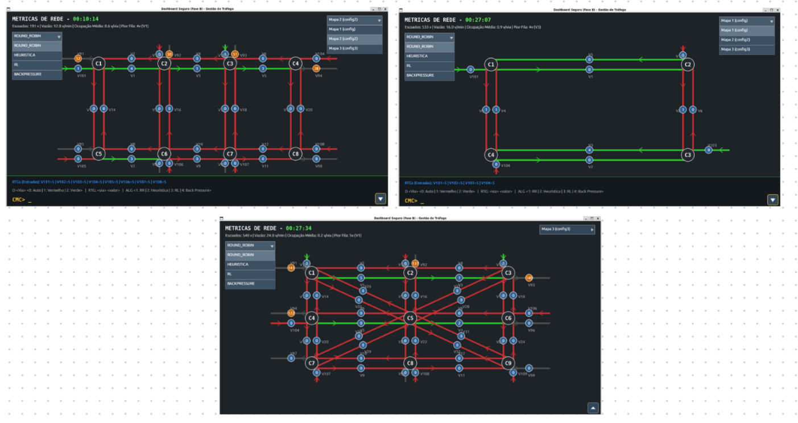
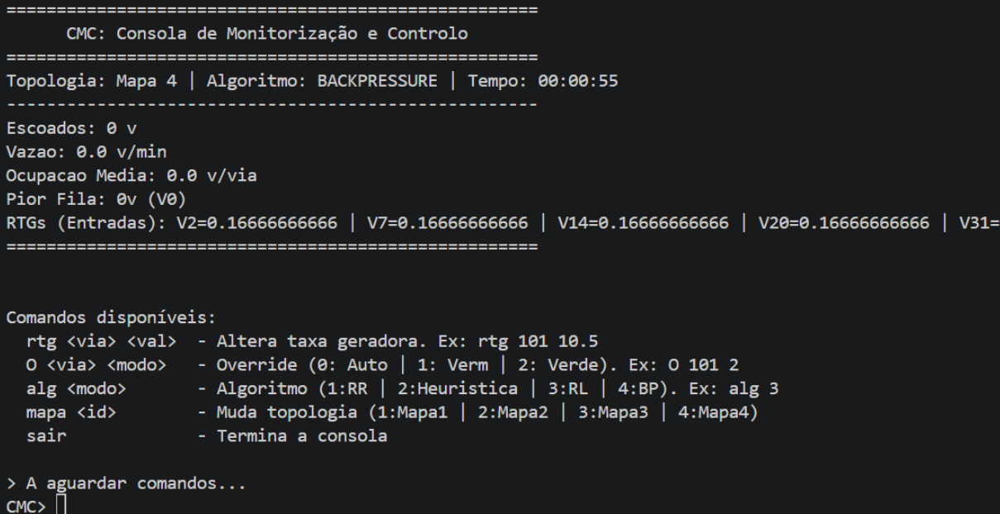
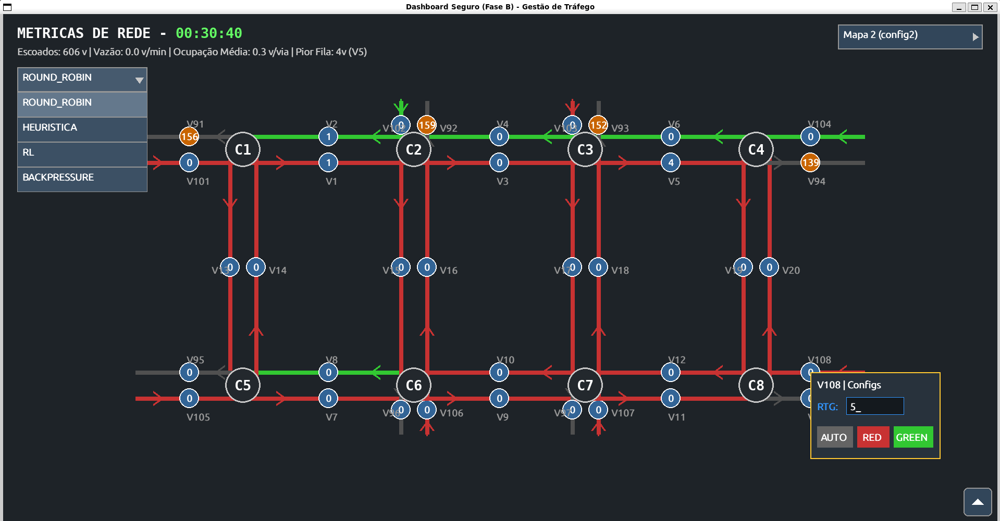
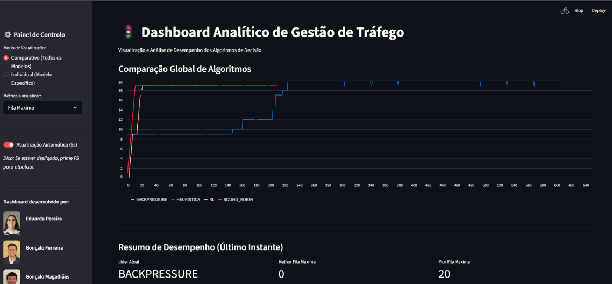

# Road Traffic Management System (RTMS) / Sistema de Gestão de Tráfego Rodoviário (SGTR)

An adaptive, safe, and topologically agnostic urban road traffic management system built on top of the **Internet-standard Network Management Framework (INMF)**. This project integrates micro-simulation, real-time control through network management protocols, machine learning algorithms, and custom cryptographic hardening layers.

Developed as part of the **Master's in Informatics Engineering (MIE)** at *Universidade do Minho* (2025/2026).

---

## 🚀 System Architecture

The architecture is built around a centralized **Central System (SC)** that coordinates all operational and simulative state directly in memory for low-latency, sub-second update cycles.

* **Road Traffic Simulation System (SSFR):** A time-discrete stochastic execution engine managing fractional vehicle accumulation, speed reductions under caution states (yellow lights), and physical network constraints like intersection *spillback*.
* **Decision System (SD):** A modular architecture evaluating the real-time grid state to optimize traffic light phase transitions using multiple available strategies.
* **SNMP Agent:** Embedded inside the Central System, acting as a live data-interchange provider mapping operational structures into an internal MIB.
* **Monitoring & Control Consoles (CMC):** Multiple external interfaces (CLI, Pygame visual interface, and a Streamlit analytics dashboard) for real-time observability.

---

## 🧠 Supported Control Strategies

The Decision System natively supports four control paradigms with incremental complexity. 
1. **Round-Robin (RR):** A rigid, deterministic, and cyclic baseline with fixed time splits.
2. **Occupancy Heuristic (HO):** Dynamic time assignment proportional to local lane vehicle counts.
3. **Backpressure (BP):** An optimization model allocating priorities based on queue differentials between source and destination roads to prevent congestion downstream.
4. **Reinforcement Learning (RL):** A tabular Q-Learning implementation featuring discrete state quantization (base 4) and localized rewards geared toward maximizing throughput and avoiding systemic deadlocks.

---

## 🔒 Security Hardening (Phase B)

Standard SNMPv2c transmits sensitive operational metadata and communities in plain text. To mitigate interception and spoofing on critical infrastructure, this system implements an active cryptographic defense layer:

* **KEK/DEK Key Architecture:** The core password is used alongside a Key Derivation Function (**PBKDF2HMAC** with SHA256 and 100,000 iterations) to derive a root Vault Key, which secures ephemeral data encryption keys.
* **Active Encryption:** Full payload wrapping using **Fernet symmetric cryptography** for all sensitive administrative `SET` actions.
* **Anti-DoS Measures:** Algorithmic rate-limiting tracking traffic frequencies per client IP address.

---

## 🛠️ Tech Stack & Dependencies

* **Language:** Python 3.10+
* **Core Libraries:**
  * `pysnmp` - SNMP Agent and Manager infrastructure orchestration  * `cryptography` - Fernet encryption & PBKDF2HMAC mechanisms.
  * `pygame` - Graphic visual interface for traffic telemetry visualization.
  * `streamlit` - Analytical and statistical business intelligence dashboard.

---

## 📈 Experimental Findings

Empirical stress-testing using progressive generation cycles demonstrated significant differences in systemic boundaries before degradation:
* **Round-Robin** network breakdown occurs early at **25 vehicles/minute**.
* **Occupancy Heuristic** pushes limits up to **35 vehicles/minute*** **Backpressure** sustains stability up to **40 vehicles/minute*** **Reinforcement Learning** provides the ultimate scaling ceiling, handling continuous influxes up to **45 vehicles/minute** without gridlock.

---

## 👥 Authorship & Distribution
Project designed and built in a balanced cross-functional collaboration
* Eduarda Pereira (PG61516) 
* Gonçalo Ferreira (PG61525) 
* Gonçalo Magalhães (PG61524) 

---
## Screenshots

*These are the three maps available*

*Here the user can control and monitor the network in a textual CMC*

*Here the user can control and monitor the network in a graphic CMC*

*This is an online dashboard with all the analytics.*
