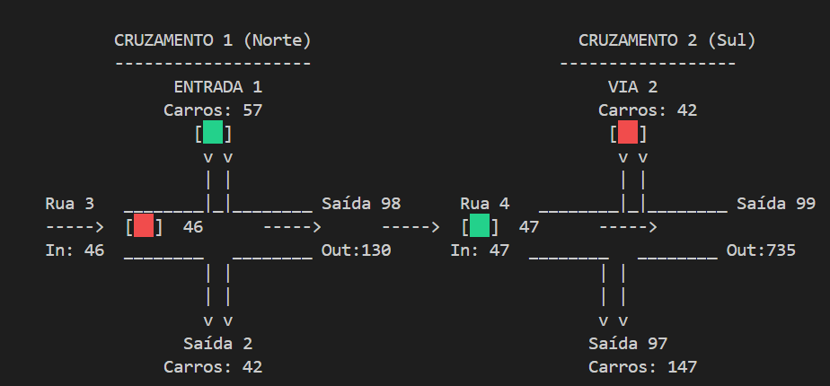

## Checklist Fase A 

1. [Lista de Requisitos Funcionais](lista_reqs_funcionais.md)    
2. [Modelo de Informação e Conjunto de Interações](arvore.md)  
3. [Investigação e Definição de Algoritmos]()
4. Escolha e Definição do mapa da rede rodoviária a simular  

