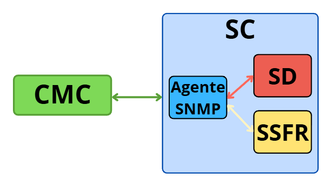

# Modelo de Informação

```
iso(1).org(3).dod(6).internet(1).experimental(3)                       
 |                                                                       
 +-- trafficMgmtMIB (2026)                                               
      |                                                                   
      +-- trafficObjects (1)                                              
           |                                                              
           +-- trafficGeneral (1)                                         
           |    |                                                         
           |    +-- simStatus (1) .............. [RW] SimOperStatus       // arranca/para/reset da simulacao
           |    +-- simStepDuration (2) ........ [RW] Integer32           // duracao do passo de simulacao (s)
           |    +-- simElapsedTime (3) ......... [RO] Counter32           // tempo total decorrido da simulacao
           |    +-- globalVehicleCount (4) ..... [RO] Gauge32             // total atual de veiculos na rede
           |    +-- globalAvgWaitTime (5) ...... [RO] Gauge32             // media global de espera dos veiculos
           |    +-- totalVehiclesEntered (6) ... [RO] Counter32           // acumulado de entradas na rede
           |    +-- totalVehiclesExited (7) .... [RO] Counter32           // acumulado de saidas da rede
           |    +-- algoMinGreenTime (8) ....... [RW] Integer32           // limite minimo do verde no algoritmo SD
           |    +-- algoMaxGreenTime (9) ....... [RW] Integer32           // limite maximo do verde no algoritmo SD
           |    +-- algoYellowTime (10) ........ [RO] Integer32           // tempo fixo de amarelo usado pelo SD
           |                                                              
           +-- crossroadTable (2)                                         // tabela dos cruzamentos da rede
           |    |                                                         
           |    +-- crossroadEntry (1) [INDEX: crossroadIndex]            // linha de cruzamento identificada por indice unico
           |         |                                                    
           |         +-- crossroadIndex (1) ...... [NA] Integer32         // chave interna do cruzamento
           |         +-- crossroadMode (2) ....... [RW] CrossroadMode     // modo de operacao (normal/allRed/flashing)
           |         +-- crossroadRowStatus (3) .. [RC] RowStatus         // criacao/ativacao/remocao da linha
           |                                                              
           +-- roadTable (3)                                              // tabela principal de vias (inclui dados do semaforo)
           |    |                                                         
           |    +-- roadEntry (1) [INDEX: roadIndex]                      // linha de via identificada por roadIndex
           |         |                                                    
           |         +-- roadIndex (1) ........... [NA] Integer32         // chave interna unica da via
           |         +-- roadName (2) ............ [RC] DisplayString     // nome legivel da via
           |         +-- roadType (3) ............ [RC] RoadType          // tipo da via (normal/sink/source)
           |         +-- roadRTG (4) ............. [RW] Gauge32           // ritmo gerador de trafego da via
           |         +-- roadMaxCapacity (5) ..... [RC] Gauge32           // capacidade maxima de veiculos da via
           |         +-- roadVehicleCount (6) .... [RO] Gauge32           // numero atual de veiculos na via
           |         +-- roadTotalCarsPassed (7) . [RO] Counter32         // acumulado de carros que passaram na via
           |         +-- roadAvgWaitTime (8) ..... [RO] Gauge32           // media de espera dos carros nesta via
           |         +-- roadCrossroadID (9) ..... [RC] Integer32         // cruzamento ao qual a via termina
           |         +-- roadTLColor (10) ........ [RO] TrafficColor      // cor atual do semaforo da via
           |         +-- roadTLTimeRemaining (11). [RO] Integer32         // segundos restantes para trocar a cor
           |         +-- roadTLGreenDuration (12). [RO] Integer32         // duracao do verde atribuida pelo SD
           |         +-- roadTLRedDuration (13) .. [RO] Integer32         // duracao do vermelho atribuida pelo SD
           |         +-- roadRowStatus (14) ...... [RC] RowStatus         // criacao/ativacao/remocao da linha da via
           |                                                              
           +-- roadLinkTable (5)                                          // tabela de ligacoes direcionadas entre vias
                |                                                         
                +-- roadLinkEntry (1) [INDEX: linkIndex]                       // linha de ligacao identificada por id unico
                     |                                                    
                     +-- linkIndex (1) ........... [NA] Integer32         // chave interna unica da ligacao
                     +-- linkSourceIndex (2) ..... [RO] Integer32         // numero da via de origem
                     +-- linkDestIndex (3) ....... [RO] Integer32         // numero da via de destino
                     +-- linkFlowRate (4) ........ [RO] Gauge32           // ritmo atual de escoamento (carros/s)
                     +-- linkActive (5) .......... [RC] LinkState         // estado logico da ligacao (ativa/inativa)
                     +-- linkCarsPassed (6) ...... [RO] Counter32         // acumulado de carros passados nesta ligacao
                     +-- linkRowStatus (7) ....... [RC] RowStatus         // criacao/ativacao/remocao da linha da ligacao
                     +-- linkOccupancyPercent (8). [RO] Gauge32           // ocupacao percentual atual da via de destino

```

# Interações Funcionais entre os Componentes do Sistema

A arquitetura do Sistema de Gestão de Tráfego Rodoviário assenta em quatro componentes fundamentais, organizados num modelo que separa a monitorização externa da lógica central de simulação e decisão. 

Como ilustrado no diagrama de blocos abaixo, o sistema centraliza o núcleo lógico no componente **SC (Sistema Central)**, criando uma separação clara entre dois domínios de comunicação: as comunicações externas via rede e os acessos internos em memória.



## A. Interações Externas (Protocolo SNMPv2c)

A comunicação externa ocorre exclusivamente entre a Consola de Monitorização e Controlo (CMC) e o Sistema Central (SC) através do protocolo SNMPv2c (sem mecanismos de segurança nesta fase).

- **Monitorização (CMC → SC)**: A CMC atua como um gestor SNMP, enviando pedidos assíncronos GET (ou GETNEXT para tabelas) ao SC para ler continuamente as instâncias da MIB (ex: roadVehicleCount, roadTLColor, roadTLTimeRemaining, roadTotalCarsPassed, roadAvgWaitTime) e atualizar a sua interface de acompanhamento em quase tempo real.

- **Configuração e Controlo (CMC → SC)**: Quando o administrador introduz um comando no prompt da CMC, esta envia um pedido SET ao agente SNMP do SC para manipular instâncias específicas, nomeadamente o objeto roadRTG de uma via (injetando tráfego no sistema) ou os parâmetros algorítmicos (algoMinGreenTime, algoMaxGreenTime).

## B. Interações Internas (Acesso Direto em Memória)

Por uma questão de simplificação e eficiência, o Sistema de Simulação do Fluxo Rodoviário (SSFR) e o Sistema de Decisão (SD) estão integrados dentro do próprio processo do SC. Como tal, não utilizam SNMP para interagir com a MIB, acedendo diretamente às estruturas de dados.

- **Interação SSFR ↔ MIB**: 
     - *Leitura*: A cada ciclo de simulação, o SSFR consulta os valores de roadRTG, a cor atual dos semáforos (roadTLColor), as vias de destino disponíveis e a lotação das mesmas para determinar se o escoamento é possível.

     - *Escrita*: O SSFR calcula o movimento dos veículos e atualiza adequadamente os valores das instâncias `roadVehicleCount` nas vias de origem (subtraindo veículos) e nas vias de destino (adicionando veículos). Atualiza também os contadores `roadTotalCarsPassed`, `roadAvgWaitTime`, `totalVehiclesEntered`, `totalVehiclesExited` e `linkCarsPassed`.

- **Interação SD ↔ MIB**: 
  - *Leitura*: O SD acede aos dados presentes na MIB (nomeadamente a carga de tráfego, representada por roadVehicleCount) e aos parâmetros algorítmicos (algoMinGreenTime, algoMaxGreenTime) para alimentar a sua heurística de cálculo.

     - *Escrita*: O SD atualiza as instâncias roadTLColor (estado da cor), roadTLTimeRemaining, roadTLGreenDuration e roadTLRedDuration para cada um dos semáforos do sistema, operando sempre em intervalos temporais múltiplos do passo da simulação do SSFR.


